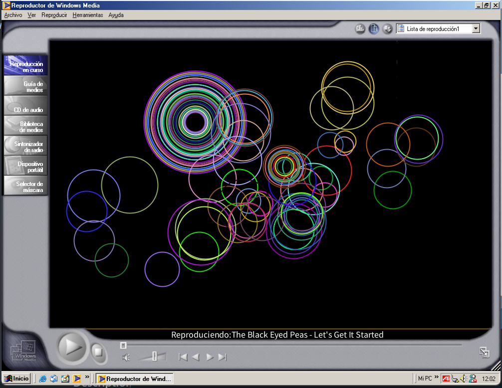

# Music Player Visualization Project

This project is an interactive music player created with Processing for the *Creative Programming for Design* course in the first semester of 2021 at the Pontifical Catholic University of Chile. It features a music player that visually represents the sound with dynamic, colorful ellipses, allowing users to switch between songs and control playback interactively.

## Project Context

The main goal of this project was to integrate sound and visuals in a dynamic way, using Processing's audio library, Minim. The music player reacts to the volume levels of the currently playing song by generating colorful ellipses that change in size and disappear over time, creating an engaging visualization that accompanies the music.

## How to Run the Project

### Requirements

To run this project, you will need:

- [Processing](https://processing.org/download/) installed on your machine.
- The [Minim library](http://code.compartmental.net/tools/minim/) for audio handling.
- The following resources:
  - `1.mp3`, `2.mp3`, `3.mp3`, `4.mp3`, and `5.mp3` (music files)
  - `guide1.png` (background image)
- Ensure the music files and `guide1.png` are placed in the same directory as the `.pde` file.

### Steps

1. Install the Minim library in Processing:
   - In the Processing IDE, go to **Sketch** -> **Import Library** -> **Add Library**.
   - Search for "Minim" and install it.
2. Place the audio files (`1.mp3`, `2.mp3`, `3.mp3`, `4.mp3`, and `5.mp3`) and the `guide1.png` image in the same folder as your `.pde` file.
3. Open the `.pde` file in the Processing IDE.
4. Run the project by pressing the `Run` button in Processing.

### Controls

- **Next Song**: Click on the right arrow icon to skip to the next song.
- **Previous Song**: Click on the left arrow icon to go to the previous song.
- **Mute/Unmute**: Click on the mute icon to toggle the sound on and off.
- **Interactive Visuals**: Move your mouse around to see the ellipses appear at your mouse's location in sync with the music.

### Code Overview

- **Audio Playback**: The Minim library is used to load and play audio files. Five different songs are preloaded into the application, and the user can switch between them interactively.
- **Sound Visualization**: The ellipses react to the sound levels (both left and right channels) and are displayed with varying sizes based on the volume.
- **Dynamic Graphics**: Ellipses are added to an array and continuously drawn on the canvas, with older ellipses being removed over time to create a smooth, dynamic visual effect.
- **User Interaction**: The player allows users to change tracks, mute/unmute the audio, and visualize music in real time by moving the mouse across the screen.

### Features

- **Dynamic Audio Visualization**: The player's sound is visualized through expanding and shrinking ellipses, which react to the volume levels of the music.
- **Song Playback Controls**: Users can switch between songs and mute/unmute the audio.
- **Background Image**: The `guide1.png` background image is loaded and displayed behind the music visualizations.
- **Colorful Effects**: The ellipses are drawn in random colors with slight transparency, creating a colorful and engaging effect.
